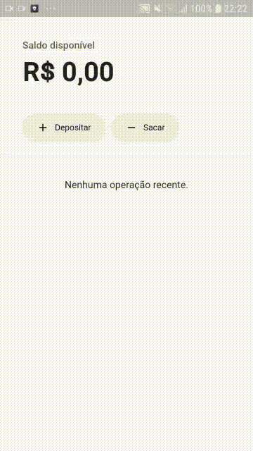

<p align="center">
    
</p>

<h1 align="center">Testes no Flutter</h1>

---

<h2>Tópicos 📋</h2>

   <p>

   - [📖 Sobre](#-sobre)
   - [📱 Preview](#-preview)
   - [🤯 Desafios e Aprendizados ao longo do caminho](#-desafios-e-aprendizados-ao-longo-do-caminho)
   - [🤔 Como usar](#-como-usar)
   - [💪 Como contribuir](#-como-contribuir)

   </p>

---

<h2>📖 Sobre</h2>

<p>
    Esse foi o projeto desenvolvido nas aula de Testes com Flutter no <a href="https://www.rocketseat.com.br/expertsclub">Experts Club</a>, um clube de aprendizado contínuo para devs.<br>
    Nesse projeto, foi ensinado a respeito de testes em uma aplicação real sem testes, e foi feita a implementação dos mesmos nesse projeto. Além de ser falado em testes de forma geral, também foi abordado técnicas mais específicas e práticas para serem usadas, como os testes unitários e os testes de Widgets.<br>
    Na segunda aula, foi implementado os testes de integração, onde usamos o flutter_driver para realizar esses testes. Foi de muito valor.<br>
</p>

---

<h2>📱 Preview</h2>

   <p align="center">
      
   </p>

---

<h2>🤯 Desafios e Aprendizados ao longo do caminho</h2>

   <p>
   Foi uma experiência super bacana de implementar testes em uma aplicação prática real, pois eles são uma parte muito importante de qualquer aplicação profissional e confiável.<br>
   Eu aprendi bastante sobre testes e consegui entender bem como eles funcionam no Flutter, e também que trabalhar com os mesmos era mais fácil do que eu imaginava. A implementação deles vai ser de enorme ajuda para mim nas próximas aplicações que criarei.<br>
   Além disso, não aprendi só sobre testes, mas reforcei alguns aprendizados com o template de aplicação que o Renato Mota disponibilizou, e também sobre sua didática ao dar a aula. Foi extraordinário, assim como todas as outras aulas do Experts Club.<br>
   </p>

---

<h2>🤔 Como usar</h2>

   ```
   Configure o ambiente de desenvolvimento na sua máquina:
   https://flutter.dev/docs/get-started/install

   - Clone o repositório:
   $ git clone https://github.com/felipecastrosales/tests_in_flutter tests_in_flutter

   - Entre no diretório:
   $ cd tests_in_flutter

   - Instale as dependências:
   $ flutter pub get

   - Execute:
   $ flutter run
   ```

---

<h2>💪 Como contribuir</h2>

   ```
   - Fork o projeto 

   - Cria uma nova branch com suas mudanças:
   $ git checkout -b my-feature

   - Salve suas mudanças e faça uma mensagem de commit message sobre suas alterações:
   $ git commit -m "feature: My new feature"

   - Envie suas mudanças:
   $ git push origin my-feature
   ```

---

   >Esse projeto foi desenvolvido com ❤️ por **[@Felipe Sales](https://www.linkedin.com/in/felipecastrosales/)**, com o instrutor **[@Renato Mota](https://www.linkedin.com/in/renatomotadeveloper)**, no **[Experts Club](https://www.rocketseat.com.br/expertsclub)**.<br>
   Se isso te ajudou, dê uma ⭐, e contribua, isso irá me ajudar também 😉

---

   <div align="center">

   [](https://www.linkedin.com/in/felipecastrosales/)

   </div>
